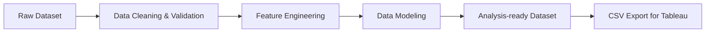

<h2 align="center">Workflow Diagram</h2>

```mermaid
graph LR;

A[Raw Dataset] --> B[Data Cleaning & Validation];

B --> C[Feature Engineering];

C --> D[Data Modeling];

D --> E[Analysis-ready Dataset];

E --> F[CSV Export for Tableau];

```
